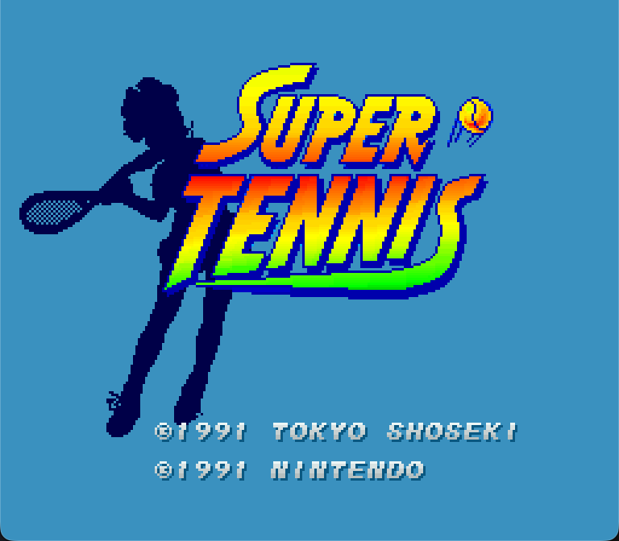
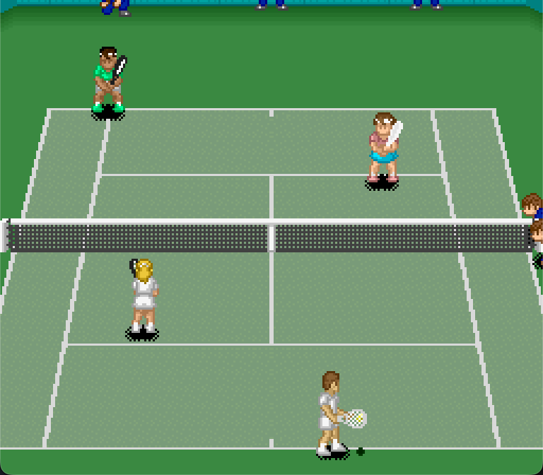
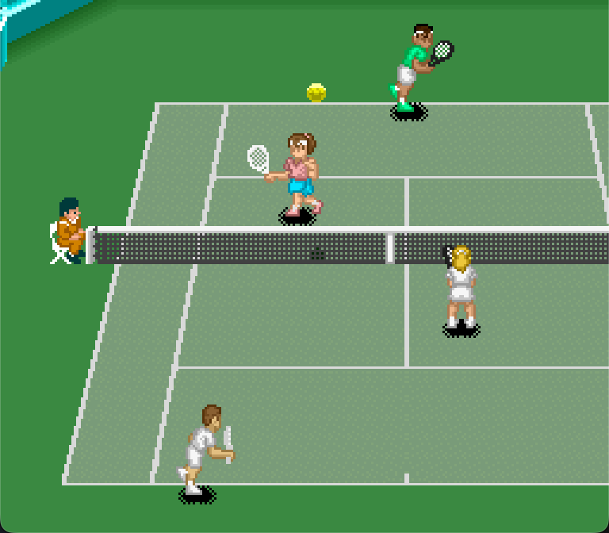

# Super Tennis Recomp

A static recompilation of the US SNES release of *Super
Tennis* for modern desktop systems, built with
[snesrecomp](https://github.com/mstan/snesrecomp).

The project runs as a native executable and requires your own cartridge dump.
This source repository does not include a ROM or generated game code.

<p align="center">
  <a href="assets/screenshots/title-screen.png"></a>
  <a href="assets/screenshots/match-start.png"></a>
  <a href="assets/screenshots/rally.png"></a>
</p>

## Project status

Single-player gameplay is working well so far, with testing through complete
matches. Menus, court rendering, audio, and keyboard and gamepad input are
working. Builds have been confirmed on macOS with Apple Silicon and Windows
x64. Linux builds have not yet been confirmed.

Development is ongoing, and not every game mode or situation has been tested. Want to get involved? Try it out, share feedback, report bugs, or contribute code. All contributions are welcome.

## Features

- Native macOS and Windows executables
- Pre-launch ROM picker and ROM identity verification
- Windowed and fullscreen display modes
- Video filtering, audio, and input settings
- In-game settings menu opened with `F1`
- One and two player local play with keyboard and gamepad support
- Deterministic headless runner for regression testing

## Quick start

This project is currently distributed as source code only. Prebuilt downloads
are not available. Follow the [build instructions](#build-from-source) for your
platform, then start `super_tennis` on macOS or Linux, or `super_tennis.exe` on
Windows.

On first launch, the ROM picker asks for your legally obtained US cartridge
dump. The selected path is remembered for later launches.

The ROM is not included and is never uploaded.

## ROM requirements

Super Tennis (USA):

| Property | Required value |
| --- | --- |
| File name | Any `.sfc` file name is accepted |
| Size | 524,288 bytes |
| Mapping | LoROM |
| SHA-256 | `6e45a80ea148654514cb4e8604a0ffcbc726946e70f9e0b9860e36c0f3fa4877` |

The build tools and launcher reject any ROM that does not match this identity.

## Controls

| SNES control | Keyboard |
| --- | --- |
| D-pad | Arrow keys |
| A | `X` |
| B | `Z` |
| X | `S` |
| Y | `A` |
| L | `Q` |
| R | `E` |
| Start | Enter |
| Select | Backspace |
| Settings | `F1` |
| Quit game (settings closed) | `Esc` |

To use an SDL-compatible gamepad, connect it and select it as the input source
for a player on the launcher's Controller page. You can also switch between
Keyboard and Gamepad under **Input > Player N Source** in the `F1` menu.


The settings menu pauses gameplay. Press `F1` again to resume, or use `Esc`
to back out of the menu. On a gamepad, press Select and Start together to open
settings.

Keyboard bindings can be changed from the launcher's Controller page. They
are saved in `keybinds.ini`; restart the application after changing them.

## Build from source

### macOS and Linux

#### macOS dependencies

Install Apple's Command Line Tools if they are not already installed:

```sh
xcode-select --install
```

Install [Homebrew](https://docs.brew.sh/Installation), including its shell
setup instructions, then install the build tools and
[SDL3](https://formulae.brew.sh/formula/sdl3):

```sh
brew install cmake ninja python sdl3
```

The Command Line Tools provide Git, the C and C++ compilers, and the macOS SDK.
No separate OpenGL package is needed on macOS.

#### Linux dependencies

Linux is currently unverified. Install the following through your
distribution's package manager:

- Git
- Python 3.11 or newer
- CMake 3.20 or newer
- Ninja
- C and C++ compilers
- SDL3 development files
- System OpenGL development files

Package names and SDL3 availability vary by distribution. If SDL3 development
files are unavailable, follow the [SDL Linux build guidance](https://wiki.libsdl.org/SDL3/README-linux).
SDL2 development files are not sufficient for this host.

#### Build and run

Once the dependencies are installed, clone and build:

```sh
git clone --recurse-submodules https://github.com/craigshaw/SuperTennisRecomp.git
cd SuperTennisRecomp
sh tools/apply-snesrecomp-patches.sh
sh tools/regenerate.sh "/path/to/Super Tennis (USA).sfc"
sh build.sh
```

Run the desktop build with the launcher:

```sh
./build/super_tennis
```

You can also pass the ROM directly:

```sh
./build/super_tennis "/path/to/Super Tennis (USA).sfc"
```

### Windows x64

Requirements:

- Git for Windows
- Python 3.11 or newer
- Visual Studio Build Tools with the C++ x64, Windows SDK, and CMake tools
  components

SDL3 is restored automatically from the pinned `vcpkg.json` manifest.

From a normal PowerShell prompt:

```powershell
git clone --recurse-submodules https://github.com/craigshaw/SuperTennisRecomp.git
cd SuperTennisRecomp
powershell -ExecutionPolicy Bypass -File .\build.ps1 `
  -RomPath "C:\path\to\Super Tennis (USA).sfc"
```

The executables and `SDL3.dll` are written to
`build\windows-msvc-x64-release\`.

Use `-SkipGenerate` for later host-only rebuilds. Use `-Fresh` when the CMake
cache or toolchain configuration must be recreated.

## Settings and troubleshooting

The application stores its settings beside the executable, normally in
`build/` on macOS or Linux and `build\windows-msvc-x64-release\` on Windows:

- `config.ini`: display, audio, input source, and launcher settings.
- `keybinds.ini`: keyboard bindings.
- `rom.cfg`: the selected ROM path.

Keep the executable and its `assets/` folder together in a directory you can
write to.

### The ROM is rejected

Check that your dump is the US release, has no copier header, and matches the
size and SHA-256 in [ROM requirements](#rom-requirements). Renaming a different
dump will not make it compatible.

On macOS, calculate the hash with:

```sh
shasum -a 256 "/path/to/Super Tennis (USA).sfc"
```

On Linux, use `sha256sum` instead of `shasum -a 256`. On Windows, use PowerShell:

```powershell
Get-FileHash -Algorithm SHA256 "C:\path\to\Super Tennis (USA).sfc"
```

### CMake cannot find SDL3

Install the SDL3 development files before building. If you installed SDL3 with
Homebrew and CMake still cannot find it, configure with its path explicitly,
then build:

```sh
cmake -S . -B build -G Ninja -DCMAKE_BUILD_TYPE=Release \
  -DSDL3_DIR="$(brew --prefix sdl3)/lib/cmake/SDL3"
cmake --build build --parallel
```

For a custom Linux installation, set `SDL3_DIR` to the directory containing
`SDL3Config.cmake`. On Windows, use `build.ps1` so the pinned vcpkg toolchain
restores SDL3 automatically.

### The keyboard or gamepad does not respond

Check **Input > Player 1 Source** (or Player 2 Source) in the `F1` menu.
Select Keyboard or Gamepad as appropriate; None disables that player's input.
For a gamepad, connect it before launching the application. If keyboard
bindings were changed, restart the application to load them. For two
players on gamepads, connect them in player order so each pad lands in the
right slot.

### Reset settings or choose a different ROM

Close the application and rename the relevant configuration file listed
above, for example `config.ini` to `config.ini.bak`. The application uses
defaults when the file is absent. Rename `keybinds.ini` to restore the default
keys, or `rom.cfg` to clear the remembered ROM path.

If the launcher was skipped, open `F1` and turn off **System > Skip Launcher**,
then restart without a ROM argument to show it again.

## How it works

`snesrecomp` analyses the ROM and translates supported 65816 CPU code into C.
Code that cannot yet be proven safe for static translation continues through
the integrated 65816 interpreter. The SNES PPU, APU, DMA, controller, and
other hardware are provided by the shared runtime.

Generated C is excluded from the source repository. Source builds generate it
locally from your verified ROM.


## Development disclosure

AI coding assistants have contributed to the runtime, tooling, testing, and
documentation under the maintainer's direction and review.

## Credits

This project is built on
[snesrecomp](https://github.com/mstan/snesrecomp) and
[recomp-ui](https://github.com/mstan/recomp-ui), together with the emulator and
recompilation projects credited by those dependencies.

## Licence

Original code in this repository is available under the
[PolyForm Noncommercial License 1.0.0](https://polyformproject.org/licenses/noncommercial/1.0.0).

Required Notice: Copyright (c) 2026 Craig Shaw

Third-party code and dependencies listed in the **Credits** section retain
their respective licences.

The *Super Tennis* ROM and generated game code are not included. The gameplay
screenshots illustrate the project; the game artwork shown in them belongs to
its respective rights holders and is not covered by the source code licence.

This project is not affiliated with or endorsed by Nintendo or any other
rights holder. *Super Tennis* and all related names and assets belong to their
respective owners.
